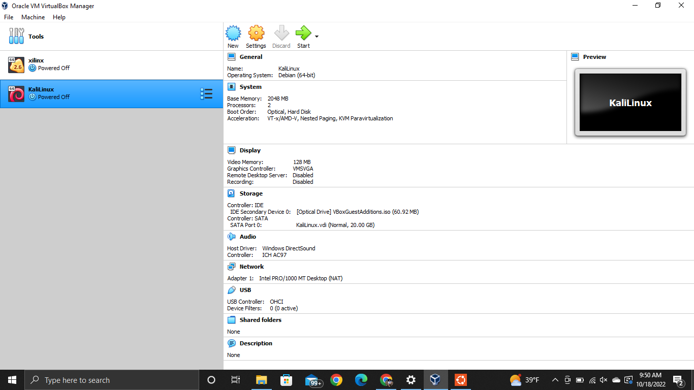
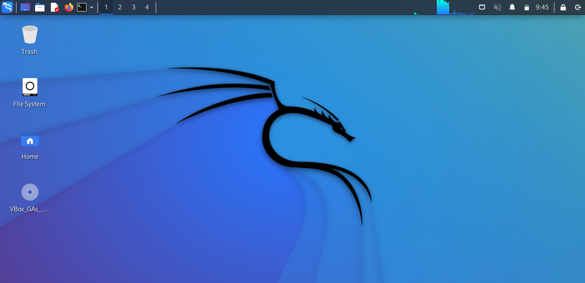

## Lab 07

- Name: Javis Okey-Walker
- Email: Okey-walker.2@wright.edu

## Part 1 Answers

1. Steps to configure virtual hardware:
- Cofigure name and operating system by choosing name of the VM, machine folder to be saved, Type of machiine, and version.

- Select memory size of the VM

- Choose the size of GB you would like to dedicate to the VM

2. 

3. Steps to download an ISO:
The ISO I chose to download was Kalilinux
- Go to Kali.org
- Click Download
- Choose the type and size of the ISO for the machine (I chose baremetal 64Bit download).

4. Steps to use ISO on VM:
To use the ISO on the VM:
- Go to settings of the virtual machine.
- GO to storage
- For storage devices select the empty Controller: IDE and choose your ISO file to use.

5. Steps to install your distribution:
- To install the distribution you will click start on the VM to boot KaliLinux and let the process install. 

6. Steps to boot to disk after install:
- Select boot to disk once you have booted KaliLinux and the option appears, after configuring the other settings.

7. Steps to use full screen mode:
- At the desktop click devices at the top
- Then click "Insert Guest Additions CD image"
- Configure CD image
- Top of the desktop click view
- Click Full Screen mode
- press right ctrl+F to exit full screen mode.
8. 

## Part 2 Answers

1. Steps to change desktop background.
- Right CLick Desktop background
- Click Desktop settings
- Select new background under "Background" tab
- Close

2. Steps to open a web browser.
- Click the Firefox icon when at desktop, firefox comes with this hypervisor.

3. Steps to install VSCode.
- On the virtual machine to to VS code download page
- download the .deb file for linux
- open terminal
- type command "sudo apt install (file name)
- Once installation is finished VS code can be opened from apps menu.

4. Steps to connect to your AWS instance from your VM.
- In VM terminal cd into .ssh
- vim the "config" file in .ssh
- enter host information in config file and save
- in home directory vim a private key file, copy private key into file, and save
- use ssh command to connect to instance "ssh -i "PrivateKey.pem username@instanceIPaddress"

