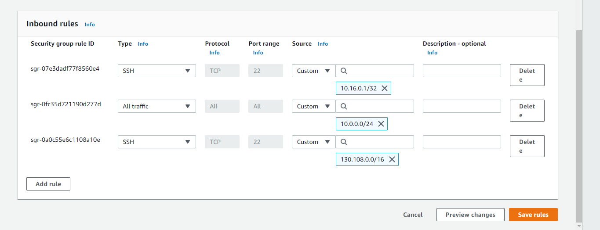

## Lab 12

- Name: Javis Okey-Walker
- Email: Okey-Walker.2@wright.edu

## Part 1 Answers:

1. `tar` options:
   - `-c  create a new archive `
   - `-v  operate verbosely`
   - `-f  use archive file or device archive`
   - `-z  filter the arhcive through gzip `
   - `-x  extract files from an archive`
2. Command(s): `tar -czvf archive.tar.gz tarTest`

## Part 2 Answers:

1. Command:  `sftp -i 2350key.pem ubuntu@44.209.93.122`
2. `sftp` options:
   - `ls Display a remote directory listing of either path or the current directory if path is not specified. `
   - `lls  Display local directory listing of either path or current directory if path is not specified. `
   - `put  Upload local-path and store it on the remote machine.`
   - `get  Retrieve the remote-path and store it on the local machine.`
3. Command(s): ` get archive.tar.gz `
4. Command(s): `tar -xf archive.tar.gz`

## Part 3 Answers:

1. `sudo adduser ituser`
2. ` ssh-keygen`
3. ` Copied the pub key that was generated and put it in a file on the new users system. Edited my systems config file and added the new users information and full path to the identity file of the public key on the new users system.`
4.  ` ssh -i authorized_keys ituser@44.209.93.122 `

## Part 4 Answers

1. Translate to network prefixes + CIDR notation:
   - Sample: `10.0.0.0 - 10.0.1.255` = `10.0.0.0/23` OR `10.0.1.0/23`
   - `130.108.0.0 - 130.108.255.255` = `130.108.0.0/16` 
   - `10.0.0.0 - 10.0.0.255` = `10.0.0.0/24`
   - `your_public_ip - your_public_ip` = `10.16.201.125/32` OR `10.16.0.1/32`
2. How you confirmed current rules are bad, and why are they bad. `This can be confirmed by seeing the systems security inbound rules, which says that all port ranges and Subnets are trusted. These rules are bad because it means it is completely open access for anyone to attempt to ssh into our system, which is a big security breach.`
3. Your implementation details and **screenshot**

4. Something invalid: `0.0.10`

